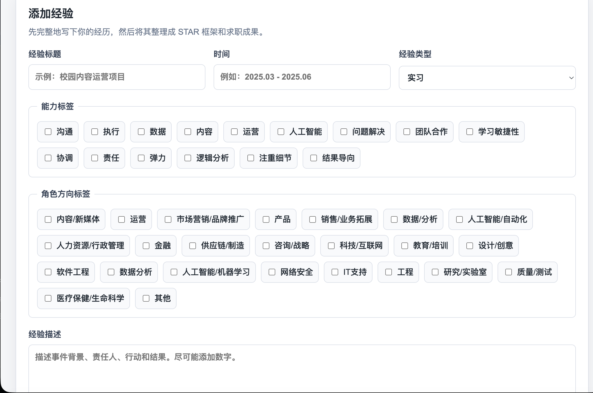
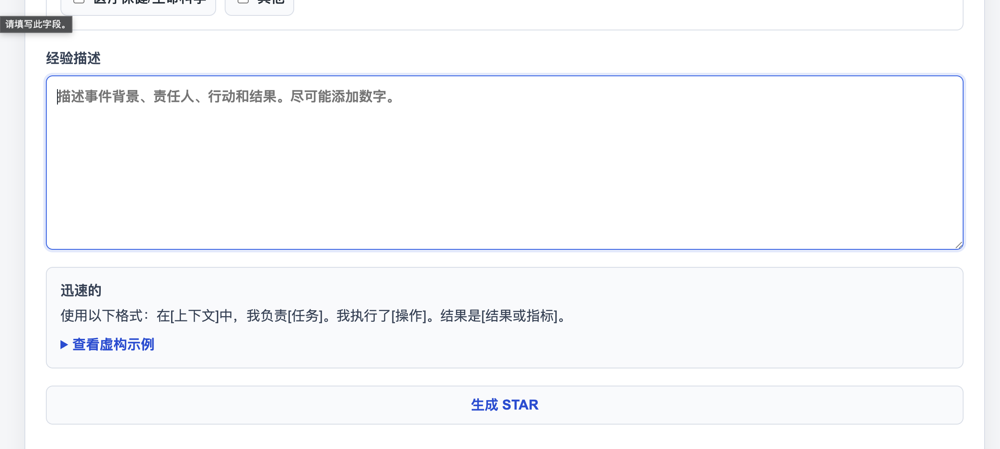
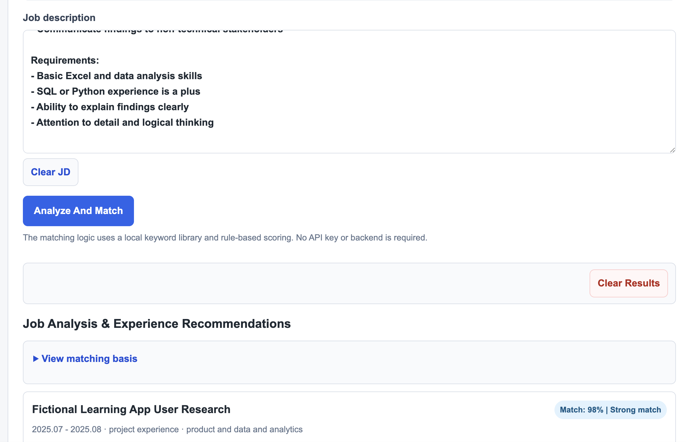
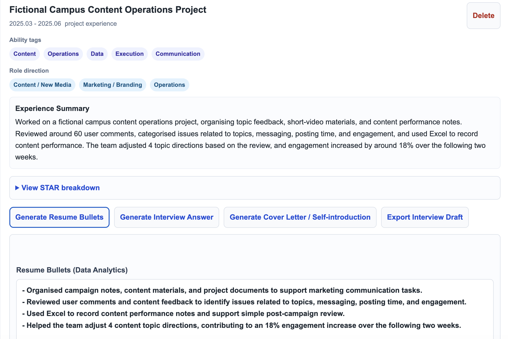

# CareerFit Workflow Tool

## Overview

CareerFit Workflow Tool is a privacy-first career workflow tool that helps users structure experiences, compare them with job descriptions, and draft resume bullets, interview answers, and cover-letter material.

It runs locally in the browser using `localStorage`, so users can try the workflow without creating an account or uploading data to a server.

The tool provides first-draft career materials. Users should review, edit, and adapt all outputs before using them in real applications.

## What It Helps With

CareerFit is designed as a small career workspace for early drafting and reflection. It helps users:

- capture experience notes in one place
- turn rough experience descriptions into STAR-style structure
- compare saved experiences with a target job description
- identify which experience may be most relevant for a role
- draft resume bullets, interview answers, and cover-letter material
- use sample data to try the workflow before adding their own non-sensitive examples

It does not replace human judgment, career coaching, or careful editing.

## Key Features

- Local experience library using browser `localStorage`
- STAR structuring for raw experience notes
- Job description input and keyword-based role analysis
- Expanded rule-based role family coverage across business, marketing, operations, product, finance, HR, creative, software engineering, data analytics, AI / machine learning, cybersecurity, IT support, engineering, research / lab, quality / testing, supply chain, and healthcare / life science support
- Experience recommendation with match percentage
- Resume bullet generation
- Interview answer generation
- Cover letter / self-introduction material generation
- English / Chinese output language option
- JSON import/export for local data management
- Static frontend architecture that can run on GitHub Pages

## How It Works

1. Add or import experiences into the local career workspace.
2. Structure each experience with title, time, type, tags, summary, and STAR fields.
3. Paste a target job description.
4. The app uses local keyword libraries and rule-based scoring to identify role signals.
5. Saved experiences are ranked against the job description.
6. The app drafts resume bullets, interview answers, and cover-letter material for human review.

No backend, login, database, or live AI API is required in the current version.

## Demo Workflow

The `demo-data/` folder includes sample data for trying the workflow.

1. Open the app.
2. Open `Advanced: Local Data Management`.
3. Choose `Import JSON Data`.
4. Select `demo-data/demo-experiences.json`.
5. Copy the Marketing Communications Assistant JD from `demo-data/demo-jd.txt`.
6. Paste it into the `Job description` field.
7. Keep `Output language` set to `English`.
8. Click `Analyze And Match`.

Expected sample recommendation order:

1. `Fictional Campus Content Operations Project`
2. `Fictional AI Resume Workflow Prototype`
3. `Fictional Learning App User Research`

The first recommendation should produce role-aware resume bullets, interview material, and cover-letter material for a Marketing Communications Assistant role.
## Screenshots

### Home



### Add Experience



### Experience Library


### Job Analysis Results



### Resume Bullet Output



## Privacy & Data Storage

CareerFit is a local-first browser app. Experiences are stored in `localStorage` under the current browser and domain. No data is sent to a server by this project.

Users should avoid entering sensitive personal information. For public screenshots or demos, use only the sample data in `demo-data/`.

The current storage model is useful for public beta testing and lightweight local use, but it is not intended as secure long-term storage for private career documents.

## AI-assisted Development Process

This project was built through an AI-assisted product and prototyping workflow.

The process included:

- breaking the idea into concrete user flows and requirements
- converting an internal local testing tool into a public beta experience
- separating private/test-only features from public-facing functionality
- refining sample data so the public example is fictional and safe to share
- iterating on matching logic after observing mismatched recommendations
- improving generated text after spotting generic or awkward output
- using targeted code changes rather than rewriting the entire project

No external AI API is used in this public version. The current project uses local JavaScript logic, keyword libraries, and template rules.

## User Feedback & Iteration

The project went through several rounds of testing and iteration:

- removed internal admin/testing pages from the public version
- changed the default interface and output language to English
- replaced private or local testing language with public beta product language
- added sample experiences and a Marketing Communications Assistant sample JD
- adjusted matching logic so marketing/content JDs do not incorrectly rank product research first
- improved resume bullets to be more specific and less template-like
- refined interview and cover-letter outputs to avoid generic phrasing and grammar stitching issues
- moved local data controls into an advanced section so the main workflow feels cleaner

## Current Limitations

- Matching is rule-based and keyword-based, not semantic AI matching.
- The app does not use a backend, database, login system, or live AI API.
- Outputs are first drafts and should be reviewed, edited, and adapted by humans.
- The tool does not verify facts, dates, metrics, or claims entered by a user.
- The tool does not guarantee job-search, interview, or application outcomes.
- Browser `localStorage` is useful for a local-first public beta, but it is not secure long-term document storage.

## Future Improvements

Possible next steps:

- improve role taxonomy and keyword weighting across more job families
- add clearer editing controls for generated outputs
- add validation prompts for missing metrics or vague experience descriptions
- make sample onboarding smoother without manual JSON import
- add screenshot examples for the GitHub README
- create a cleaner separation between data model, matching logic, and UI rendering
- optionally explore a future AI API version with clear privacy and consent boundaries

## Tools Used

- HTML
- CSS
- JavaScript
- Browser `localStorage`
- JSON sample data
- GitHub Pages-compatible static hosting
- AI-assisted requirement breakdown, workflow design, prototyping, and iteration

## Portfolio Context

This project also serves as a portfolio case study in AI-assisted workflow design, requirement breakdown, prototyping, and user-feedback iteration.

The focus is not on presenting a full-stack production system. The focus is on turning a messy real-world workflow into a usable local-first browser product, then improving it through testing and iteration.

## Live Version

After publishing with GitHub Pages, the app can run from:

```text
https://<your-github-username>.github.io/CareerFit-Workflow-Tool/
```

## Project Structure

```text
CareerFit-Workflow-Tool/
├── index.html
├── styles.css
├── app.js
├── job-keyword-library.js
├── bullet-pattern-library.js
├── demo-data/
│   ├── demo-experiences.json
│   ├── demo-jd.txt
│   ├── demo-jd-zh.txt
│   ├── demo-jd-software-engineering.txt
│   ├── demo-jd-data-analyst.txt
│   └── demo-jd-research-assistant.txt
├── screenshots/
│   └── README.md
└── README.md
```

## Demo Data

The `demo-data/` folder contains sample data for trying the workflow.

- `demo-experiences.json` contains three fictional sample experiences.
- `demo-jd.txt` contains a fictional Marketing Communications Assistant job description.
- `demo-jd-zh.txt` contains a Chinese New Media Operations Assistant job description for testing the Chinese workflow.
- `demo-jd-software-engineering.txt` contains a fictional Frontend Developer Intern job description.
- `demo-jd-data-analyst.txt` contains a fictional Data Analyst Intern job description.
- `demo-jd-research-assistant.txt` contains a fictional Research Assistant job description.

For public screenshots, use only the fictional sample data.

## GitHub Pages Deployment

This project is ready for GitHub Pages because it uses plain HTML, CSS, and JavaScript.

Recommended setup:

1. Create a public GitHub repository named `CareerFit-Workflow-Tool`.
2. Upload the files in this folder.
3. In GitHub, open `Settings` -> `Pages`.
4. Choose `Deploy from a branch`.
5. Select the `main` branch and root folder.
6. Open the generated Pages URL.

## Status

Status: Public beta / local-first static version.

The current version is a static local-first browser app without backend, login, database, or live AI API integration. It is usable as a lightweight career-material drafting workflow, with the expectation that users review and edit all generated outputs.
